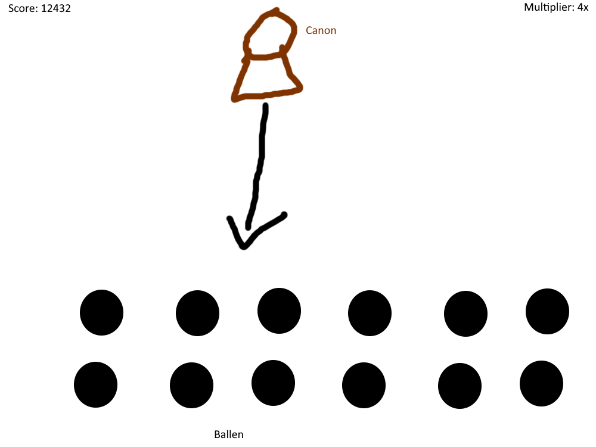
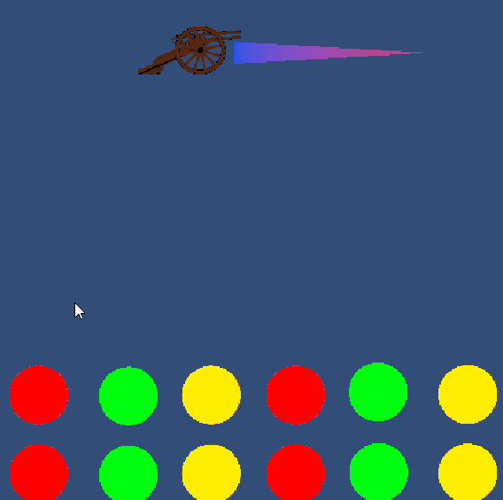
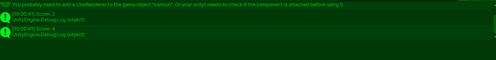

# Peggle Game Periode 2 

## 1.1 

 
In week 1 heb ik deze concept gemaakt van mijn game. 
En ik heb uitgeplant wat ik wellicht moet gaan maken. 

## 2.1 

 
In 2.1 heb ik physics toegevoegt aan de bal zodat het botst met de grotere ballen op de grond. 

## 2.2 
 

In 2.2 heb ik een shooting line toegevoegd zodat je ziet waar je mikt. 

## 3.1 

 

in 3.1 werken scores zoals het moet in de console. 
